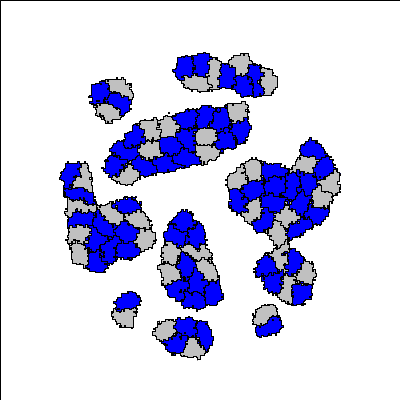
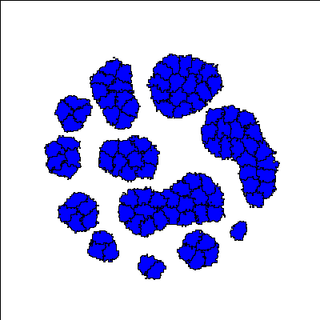
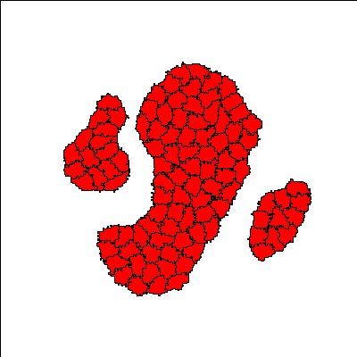

# Self-organized Multicellular Structures
Simulation files for generating the results from the manuscript "Self-organized Multicellular Structures from Simple Cell Signaling: a Computational Model".

Simulations run on the open-source platform [Morpheus](https://morpheus.gitlab.io/).

## Main Experiments

1. Two Genotype Two Layer Structure (Figure 2 in Manuscript)
  

Simulation file: TwoGenotypesTwoLayers_Fig2.xml

2. Two Genotype Three Layer Structure (Figure 5 in Manuscript)

Simulation file: ThreeLayerReciprocalSignaling_Fig5.xml

3. Single Genotype Two Layer Structyre (Figure 8 in Manuscript)

Simulation File: Single_Genotype_to_Two_Layer_Circuit_Fig8.xml